# 🤖 TaskBot - Полное руководство пользователя

## 📖 Что это за бот?

**TaskBot** — это умный Telegram-бот для управления задачами и отслеживания личной активности. Он помогает вам:

- ✅ Организовывать задачи по типам и приоритетам
- 📊 Ведить статистику активности (шаги, сон, настроение)
- 🚀 Отслеживать рабочие сессии (спринты)
- 📅 Получать ежедневные отчеты о задачах
- ⏰ Получать напоминания о важных задачах

Бот использует удобное меню с кнопками, поэтому вам не нужно запоминать команды — всё доступно через интуитивный интерфейс.

---

## 🗺️ Блок-схема взаимодействия с ботом

Ниже представлена полная карта всех возможных взаимодействий с ботом. Она показывает, какие команды и кнопки куда ведут, и как пользователь может перемещаться по интерфейсу.

```mermaid
graph TD
    Start["/start"] --> MainMenu["Главное меню"]
    
    MainMenu --> TasksMenu["Задачи"]
    MainMenu --> StatsMenu["Статистика"]
    MainMenu --> SleepMenu["Сон"]
    MainMenu --> MoodMenu["Настроение"]
    MainMenu --> StepsMenu["Шаги"]
    MainMenu --> SprintsMenu["Спринты"]
    
    subgraph Tasks["📋 Задачи"]
        direction TB
        TasksMenu --> AddTask["Добавить задачу"]
        TasksMenu --> ViewActive["Активные"]
        TasksMenu --> ViewDone["Завершенные"]
        TasksMenu --> ViewCancelled["Отмененные"]
        TasksMenu --> AddNote["Добавить заметку"]
        TasksMenu --> Complete["Завершить"]
        TasksMenu --> Cancel["Отменить"]
        
        AddTask --> TypeA["Тип A"]
        AddTask --> TypeB["Тип B"]
        AddTask --> TypeC["Тип C"]
        AddTask --> TypePurchase["Покупки"]
        AddTask --> TypePerm["Постоянная D"]
        AddTask --> TypeTemp["Временная"]
        
        TypeA --> InputText["Ввод текста"]
        TypeB --> InputText
        TypeC --> InputText
        TypePurchase --> InputText
        TypePerm --> InputText
        TypeTemp --> InputDateTime["Ввод даты/времени"]
        
        InputText --> TaskCreated["✅ Задача создана"]
        InputDateTime --> TaskCreated
        
        AddNote --> InputNote["Ввод: номер + текст"]
        Complete --> InputNum["Ввод номера"]
        Cancel --> InputNum
        
        InputNote --> NoteAdded["✅ Заметка добавлена"]
        InputNum --> TaskDone["✅ Задача завершена"]
        InputNum --> TaskCancelled["❌ Задача отменена"]
    end
    
    subgraph Stats["📊 Статистика"]
        direction TB
        StatsMenu --> Weekly["За неделю"]
        StatsMenu --> All["За всё время"]
        StatsMenu --> PermStats["Постоянные задачи"]
        
        Weekly --> WeeklyResult["📊 Статистика + графики"]
        All --> AllResult["📊 Статистика + графики"]
        PermStats --> PermResult["📊 Статистика"]
    end
    
    subgraph Sleep["😴 Сон"]
        direction TB
        SleepMenu --> StartSleep["Начать сон"]
        SleepMenu --> EndSleep["Проснуться"]
        
        StartSleep --> SleepRec["✅ Записано"]
        EndSleep --> WakeRec["✅ Записано"]
    end
    
    subgraph Mood["😊 Настроение"]
        direction TB
        MoodMenu --> WriteMood["Записать"]
        WriteMood --> InputMood["Ввод текста"]
        InputMood --> MoodRec["✅ Записано"]
    end
    
    subgraph Steps["👟 Шаги"]
        direction TB
        StepsMenu --> InputSteps["Ввод количества"]
        InputSteps --> StepsRec["✅ Записано"]
    end
    
    subgraph Sprints["🚀 Спринты"]
        direction TB
        SprintsMenu --> StartSprint["Начать"]
        SprintsMenu --> EndSprint["Завершить"]
        SprintsMenu --> ListSprints["Список"]
        
        StartSprint --> InputSprint["Ввод описания"]
        InputSprint --> SprintStarted["✅ Начат"]
        EndSprint --> SprintFinished["✅ Завершен"]
        ListSprints --> SprintsList["📋 Список"]
    end
    
    subgraph Commands["⌨️ Прямые команды"]
        direction TB
        CmdTasks["/tasks"] --> ViewActive
        CmdDoneTasks["/done_tasks"] --> ViewDone
        CmdCancelledTasks["/cancelled_tasks"] --> ViewCancelled
        CmdDone["/done номер"] --> TaskDone
        CmdText["/text номер текст"] --> NoteAdded
        CmdWeekly["/weekly"] --> WeeklyResult
        CmdAll["/all"] --> AllResult
        CmdSprints["/sprints"] --> SprintsList
        CmdDaily["/daily"] --> DailyReport
    end
    
    subgraph Daily["📅 Ежедневный отчет"]
        direction TB
        DailyReport["Автоматически в 6:00"] --> DailyDisplay["Список задач"]
        DailyDisplay --> DailyComplete["Отметить задачу"]
        DailyDisplay --> DailyRefresh["Обновить статус"]
        DailyComplete --> DailyDisplay
        DailyRefresh --> DailyDisplay
    end
    
    subgraph Reminders["🔔 Напоминания"]
        direction TB
        Reminder24h["За 24ч"] --> ReminderSent["📨 Отправлено"]
        Reminder3h["За 3ч"] --> ReminderSent
        Reminder1h["За 1ч"] --> ReminderSent
    end
    
    TaskCreated --> MainMenu
    NoteAdded --> MainMenu
    TaskDone --> MainMenu
    TaskCancelled --> MainMenu
    WeeklyResult --> MainMenu
    AllResult --> MainMenu
    PermResult --> MainMenu
    SleepRec --> MainMenu
    WakeRec --> MainMenu
    MoodRec --> MainMenu
    StepsRec --> MainMenu
    SprintStarted --> MainMenu
    SprintFinished --> MainMenu
    SprintsList --> MainMenu
    
    classDef menuStyle fill:#e1f5ff,stroke:#01579b,stroke-width:2px
    classDef actionStyle fill:#fff3e0,stroke:#e65100,stroke-width:2px
    classDef inputStyle fill:#f3e5f5,stroke:#4a148c,stroke-width:2px
    classDef resultStyle fill:#e8f5e9,stroke:#1b5e20,stroke-width:2px
    classDef commandStyle fill:#fff9c4,stroke:#f57f17,stroke-width:2px
    
    class MainMenu,TasksMenu,StatsMenu,SleepMenu,MoodMenu,StepsMenu,SprintsMenu menuStyle
    class AddTask,ViewActive,ViewDone,ViewCancelled,AddNote,Complete,Cancel,StartSleep,EndSleep,WriteMood,StartSprint,EndSprint,ListSprints actionStyle
    class InputText,InputDateTime,InputNote,InputNum,InputMood,InputSteps,InputSprint inputStyle
    class TaskCreated,NoteAdded,TaskDone,TaskCancelled,WeeklyResult,AllResult,PermResult,SleepRec,WakeRec,MoodRec,StepsRec,SprintStarted,SprintFinished,SprintsList resultStyle
    class CmdTasks,CmdDoneTasks,CmdCancelledTasks,CmdDone,CmdText,CmdWeekly,CmdAll,CmdSprints,CmdDaily commandStyle
```

### Легенда блок-схемы

- 🔵 **Синие блоки** — меню и разделы навигации
- 🟠 **Оранжевые блоки** — действия и операции
- 🟣 **Фиолетовые блоки** — ввод данных пользователем
- 🟢 **Зеленые блоки** — результаты операций
- 🟡 **Желтые блоки** — прямые команды (альтернатива меню)

---

## 🚀 Быстрый старт

### 1. Запуск бота

1. Найдите бота в Telegram (или запустите его локально)
2. Отправьте команду `/start`
3. Появится главное меню с кнопками

### 2. Первые шаги

- **Создайте первую задачу**: Нажмите "📋 Задачи" → "➕ Добавить задачу"
- **Запишите шаги**: Нажмите "👟 Шаги" и введите количество
- **Посмотрите статистику**: Нажмите "📊 Статистика" → "📅 За неделю"

---

## 📋 Управление задачами

### Типы задач

Бот поддерживает несколько типов задач:

| Тип | Эмодзи | Описание | Время выполнения |
|-----|--------|----------|------------------|
| **A** | ⚡ | Быстрые задачи | Менее 15 минут |
| **B** | 🔥 | Основные задачи | Более 15 минут |
| **C** | 📦 | Отложенные задачи | Не срочные |
| **D** | 🏷️ | Постоянные задачи | Повторяющиеся ежедневно |
| **Покупки** | 🛒 | Список покупок | Отдельная категория |

### Как создать задачу

#### Через меню:
1. Нажмите "📋 Задачи" в главном меню
2. Выберите "➕ Добавить задачу"
3. Выберите тип задачи (A, B, C, Покупки, Постоянная, Временная)
4. Введите текст задачи

#### Через команды:
- Используйте кнопки меню (рекомендуется)

### Специальные типы задач

#### 🏷️ Постоянные задачи (D)
- Задачи, которые нужно выполнять регулярно (например, "Утренняя зарядка")
- Отображаются отдельно в ежедневном отчете
- Можно отмечать как выполненные каждый день
- Статистика выполнения за последние 30 дней

#### ⏰ Временные задачи
- Задачи с дедлайном (сроком выполнения)
- Формат ввода: `Д.М [.ГГГГ] ЧЧ:ММ Текст задачи`
- Примеры:
  - `5.11 8:00 военка`
  - `05.11.2025 18:00 Позвонить клиенту`
  - `31.12.2025 23:59 Новый год`
- Автоматические напоминания:
  - За 24 часа до дедлайна
  - За 3 часа до дедлайна
  - За 1 час до дедлайна

#### 🛒 Покупки
- Быстрые покупки, отображаются отдельной категорией
- Удобно для списка покупок в магазине

### Просмотр задач

#### Активные задачи
- **Меню**: "📋 Задачи" → "📋 Активные задачи"
- **Команда**: `/tasks`
- Показывает все незавершенные и неотмененные задачи

#### Завершенные задачи
- **Меню**: "📋 Задачи" → "✅ Завершенные задачи"
- **Команда**: `/done_tasks`
- Показывает все выполненные задачи с датой завершения

#### Отмененные задачи
- **Меню**: "📋 Задачи" → "❌ Отмененные задачи"
- **Команда**: `/cancelled_tasks`
- Показывает отмененные задачи (не отображаются в активных)

### Работа с задачами

#### Завершить задачу
1. **Через меню**: "📋 Задачи" → "🏁 Завершить задачу" → введите номер
2. **Через команду**: `/done <номер>`
3. **В ежедневном отчете**: нажмите на кнопку с задачей

#### Отменить задачу
1. **Через меню**: "📋 Задачи" → "🚫 Отменить задачу" → введите номер
2. Задача будет скрыта из активных, но доступна в разделе "Отмененные задачи"

#### Добавить заметку к задаче
1. **Через меню**: "📋 Задачи" → "📝 Добавить заметку" → введите `номер текст заметки`
2. **Через команду**: `/text <номер> <текст заметки>`
3. Пример: `/text 12 Прошёл тесты`

---

## 📅 Ежедневные отчеты

### Что это?

Каждый день в 6:00 утра бот автоматически отправляет вам отчет со всеми активными задачами на сегодня.

### Что в отчете?

- 📋 Все активные задачи, сгруппированные по типам
- 🏷️ Постоянные задачи (D)
- 🛒 Покупки
- ⏰ Временные задачи с дедлайнами
- ✅ Завершенные сегодня задачи

### Как использовать?

1. **Отметить задачу как выполненную**: Нажмите на кнопку с задачей в отчете
2. **Обновить статус**: Нажмите "🔄 Обновить статус" для добавления новых задач
3. **Отправить отчет вручную**: Команда `/daily`

### Особенности

- Отчет отправляется только один раз в день
- Можно отмечать задачи прямо в отчете
- Постоянные задачи отмечаются отдельно (не завершаются, а отмечаются за день)
- Обычные задачи при отметке завершаются полностью

---

## 😴 Отслеживание сна

### Как использовать?

1. Нажмите "😴 Сон" в главном меню
2. Перед сном: нажмите "😴 Начать сон" — бот запишет время засыпания
3. После пробуждения: нажмите "🌅 Проснуться" — бот запишет время пробуждения

### Что записывается?

- ⏰ Время засыпания
- ⏰ Время пробуждения
- 📊 Автоматический расчет продолжительности сна (в статистике)

---

## 😊 Мониторинг настроения

### Как использовать?

1. Нажмите "😊 Настроение" в главном меню
2. Выберите "✍️ Записать настроение"
3. Введите текстовое описание вашего настроения

### Примеры записей:

- "Отличное настроение, всё получается!"
- "Чувствую усталость, но доволен результатами"
- "Волнуюсь перед важной встречей"

### Где смотреть записи?

- В статистике за неделю/всё время
- Показываются последние 3-5 записей с датами

---

## 👟 Подсчет шагов

### Как использовать?

1. Нажмите "👟 Шаги" в главном меню
2. Введите количество пройденных шагов (только число)

### Ограничения:

- ✅ Минимум: 0 шагов
- ✅ Максимум: 100,000 шагов в день
- ⚠️ Отрицательные числа не принимаются

### Что записывается?

- 📊 Количество шагов
- 📅 Дата записи
- 📈 Статистика: общее количество и среднее в день

---

## 🚀 Управление спринтами

### Что такое спринт?

Спринт — это рабочая сессия с определенной целью. Бот отслеживает время начала и окончания.

### Как использовать?

#### Начать спринт:
1. Нажмите "🚀 Спринты" в главном меню
2. Выберите "🚀 Начать спринт"
3. Введите описание спринта (например: "Разработка новой функции")

#### Завершить спринт:
1. Нажмите "🚀 Спринты" → "🏁 Завершить спринт"
2. Бот автоматически рассчитает длительность

#### Просмотреть спринты:
1. Нажмите "🚀 Спринты" → "📋 Список спринтов"
2. Или команда `/sprints`

### Что показывается?

- 🆔 ID спринта
- 🟢 Статус (Активный/Завершен)
- ⏰ Время начала и окончания
- ⏱️ Длительность в часах
- 📝 Описание

---

## 📊 Статистика

### Доступные периоды

1. **📅 За неделю** — статистика за последние 7 дней
2. **📈 За всё время** — общая статистика с начала использования
3. **🏷️ Постоянные задачи** — статистика выполнения постоянных задач за 30 дней

### Что в статистике?

#### 📋 Задачи
- Общее количество задач
- Распределение по типам (A, B, C) с процентами
- Процент выполнения задач

#### 👟 Шаги
- Общее количество шагов
- Среднее количество в день
- График тренда шагов

#### 😊 Настроение
- Количество записей
- Последние 3 записи с датами

#### 😴 Сон
- Количество записей сна
- Средняя продолжительность сна
- График качества сна

#### 🚀 Спринты
- Общее количество спринтов
- Последние 3 спринта с деталями
- Статусы (активные/завершенные)

#### 🏆 Productivity Score
- Общий балл продуктивности
- Рассчитывается на основе задач, шагов, настроения и спринтов

### Как получить статистику?

#### Через меню:
1. Нажмите "📊 Статистика" в главном меню
2. Выберите период (За неделю / За всё время / Постоянные задачи)

#### Через команды:
- `/weekly` — статистика за неделю
- `/all` — статистика за всё время
- `/sprints` — список всех спринтов

### Графики

Статистика включает визуальные графики:
- 📊 Распределение задач по типам
- 📈 Тренд шагов по дням
- 😊 Тренд настроения
- 😴 Качество сна

---

## ⌨️ Все команды бота

### Основные команды

| Команда | Описание |
|---------|----------|
| `/start` | Запустить бота и показать главное меню |
| `/tasks` | Показать активные задачи |
| `/done_tasks` | Показать завершенные задачи |
| `/cancelled_tasks` | Показать отмененные задачи |
| `/done <номер>` | Отметить задачу как выполненную |
| `/text <номер> <текст>` | Добавить заметку к задаче |
| `/weekly` | Статистика за неделю |
| `/all` | Статистика за всё время |
| `/sprints` | Список спринтов |
| `/daily` | Отправить ежедневный отчет вручную |

### Рекомендация

💡 **Используйте меню с кнопками** — это удобнее, чем команды! Все функции доступны через интуитивный интерфейс.

---

## 🎯 Примеры использования

### Пример 1: Создание задачи с дедлайном

1. "📋 Задачи" → "➕ Добавить задачу" → "⏰ Временная"
2. Введите: `5.11 18:00 Позвонить клиенту`
3. Бот создаст задачу и будет напоминать:
   - За 24 часа (4.11 в 18:00)
   - За 3 часа (5.11 в 15:00)
   - За 1 час (5.11 в 17:00)

### Пример 2: Ежедневная рутина

1. Создайте постоянную задачу: "📋 Задачи" → "➕ Добавить задачу" → "🏷️ Постоянная (D)"
2. Введите: `Утренняя зарядка`
3. Каждый день в отчете вы сможете отмечать её как выполненную
4. В статистике "🏷️ Постоянные задачи" увидите процент выполнения за месяц

### Пример 3: Отслеживание активности

1. Утром: "👟 Шаги" → введите количество шагов
2. Вечером: "😴 Сон" → "😴 Начать сон"
3. Утром: "😴 Сон" → "🌅 Проснуться"
4. В статистике увидите тренды активности

### Пример 4: Рабочая сессия

1. Начало работы: "🚀 Спринты" → "🚀 Начать спринт" → `Разработка API`
2. Работаете...
3. Конец работы: "🚀 Спринты" → "🏁 Завершить спринт"
4. Бот покажет длительность сессии

---

## 🔔 Напоминания

### Автоматические напоминания

Для задач с дедлайном (временные задачи) бот автоматически отправляет напоминания:

- ⏰ **За 24 часа** до дедлайна
- ⏰ **За 3 часа** до дедлайна
- ⏰ **За 1 час** до дедлайна

### Как это работает?

1. Создайте временную задачу с дедлайном
2. Бот автоматически отслеживает время
3. В нужный момент вы получите напоминание в Telegram

---

## 💡 Советы по использованию

### Организация задач

- ⚡ **Тип A**: Используйте для быстрых дел (ответить на сообщение, сделать звонок)
- 🔥 **Тип B**: Для основных задач (написать отчет, подготовить презентацию)
- 📦 **Тип C**: Для задач, которые можно отложить
- 🏷️ **Тип D**: Для ежедневных рутин (зарядка, чтение, медитация)
- 🛒 **Покупки**: Для списка покупок

### Ежедневный ритм

1. **Утро**: Проверьте ежедневный отчет (приходит в 6:00)
2. **День**: Отмечайте выполненные задачи, записывайте шаги
3. **Вечер**: Запишите настроение, начните отслеживание сна

### Статистика

- Регулярно просматривайте статистику за неделю
- Анализируйте тренды (шаги, настроение, сон)
- Используйте Productivity Score для оценки прогресса

---

## ❓ Часто задаваемые вопросы

### Как удалить задачу?

Задачи нельзя удалить, но можно:
- ✅ Завершить (через "🏁 Завершить задачу" или `/done`)
- ❌ Отменить (через "🚫 Отменить задачу")

### Можно ли изменить задачу?

Сейчас изменение задач не поддерживается. Рекомендуется:
- Отменить старую задачу
- Создать новую с правильным текстом

### Как работает ежедневный отчет?

- Отправляется автоматически в 6:00 утра
- Содержит все активные задачи на сегодня
- Можно отметить задачи прямо в отчете
- Можно отправить вручную командой `/daily`

### Что делать, если забыл записать шаги?

Просто запишите их позже — бот сохранит запись с текущей датой.

### Можно ли использовать бота нескольким людям?

Сейчас бот работает в однопользовательском режиме. Все данные хранятся в одной базе данных.

---

## 🛠️ Технические детали

### Хранение данных

- Все данные хранятся в локальной базе данных SQLite
- Файл базы: `data/tasks.db`
- Логи бота: `logs/bot.log`

### Безопасность

- Все данные хранятся локально
- Токен бота хранится в переменных окружения (`.env`)
- Никто кроме вас не имеет доступа к вашим данным

---

## 🎉 Заключение

**TaskBot** — это ваш персональный помощник для организации задач и отслеживания активности. Используйте его регулярно, и вы увидите, как улучшается ваша продуктивность!

**Удачного использования! 🚀**

